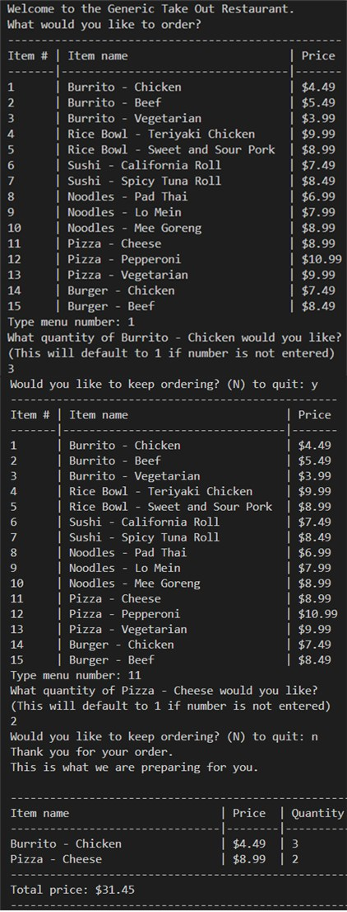

# Restaurant Menu and Order System

  [](https://opensource.org/licenses/MIT)
  
  ## Table of Contents
  
  * [Description](#description)
  * [Technologies Used](#technologies-used)
  * [Usage](#usage)
  * [Contributing](#contributing)
  * [How to Run the Program](#how-to-run-the-program)
  * [License](#license)
  * [Questions](#questions)
  
  ## Description
  This app uses Python to build out a program that allows users view a menu, place orders, and receive a receipt in an accessible, user-friendly format.

  ## Technologies-Used
  To successfully run this application, these are the following installation requirements: 
  * **Python** *Programming Logic*
  * **Dictionary**  *Storing Menu Data*


  ## Usage 
  Here is an example screenshot of the Restaurant Menu and Order System App:

  

  
  ## Contributing
  The following resources were used for development and debugging:
  * ED Platform Auto-grader
  * Class Activities

  
  ## How-to-Run-the-Program 
  Type the code below in the terminal, running each line of code separately.

  1. Clone the Repository:
  **Note:** This github url is a generic format
  ```bash
  git clone https://github.com/username/repo-name.git

  ```

  2. Navigate in the project folder Root Directory and Run the program:
  ```bash
  cd project-name/

  ```

  ```bash
  python order_system.py

  ```
  **OR**

  ```bash
  py order_system.py

  ```

  ## License
  This project is Licensed under the MIT License.
  
  ## Questions
  Feel Free to contact me for any additional questions
  * GitHub: [jbarry89](https://github.com/jbarry89/)
  * Email: joelbarry8907@hotmail.com 


